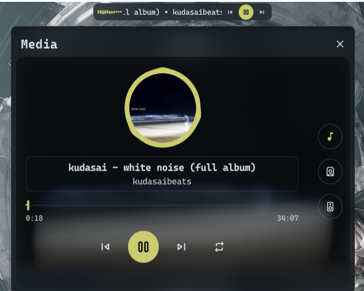
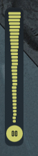

# Media Player Plus

A simple extended version of the default media widget from DMS with mainly improved support for vertical layouts while also adding more control over the widgets.

## Features

- Improved Vertical layout settings
  - Can show title in vertical layout, complete with scrollable text option, and optional backdrop behind the title
  - Can set max height for title area in vertical layout
  - Can show next/previous buttons in vertical layout
- Rotated visualizer for vertical layout
- Settings for visualizer bar count and width / height
- Optional popout size settings for both the horizontal and vertical layouts
- Optional extra backdrop panel behind the media content
- Optional use of the track artwork as a blurred backdrop for the popout content

## IPC

```bash
# Open the media player popout
dms ipc call MediaControlPlus openPopout
# Close the media player popout
dms ipc call MediaControlPlus closePopout
# Toggle the media player popout
dms ipc call MediaControlPlus togglePopout
```

## Some Preview

### Preview







