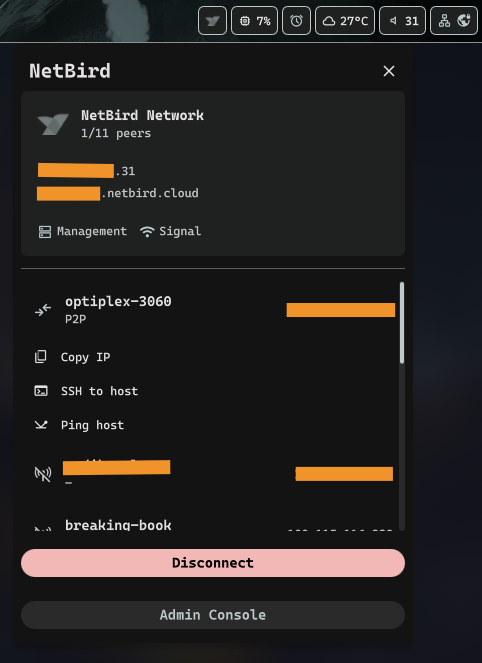

# NetbirdStatus

> [!NOTE]  
> **Disclaimer:** This is a community-created plugin built on top of the NetBird CLI tool. It is not affiliated with, endorsed by, or officially connected to NetBird GmbH.

A NetBird VPN status plugin for DMS that shows your NetBird connection status and peers in the menu bar.

Ported from [netbird plugin in noctalia-shell](https://noctalia.dev/plugins/netbird/) by [Cleeboost](https://github.com/Cleboost). This port does not include adding IPC stuff, only the widget and its functionality.

## Requirements

- NetBird must be installed on your system
- NetBird must be set up and authenticated
- The netbird CLI must be accessible in your PATH

