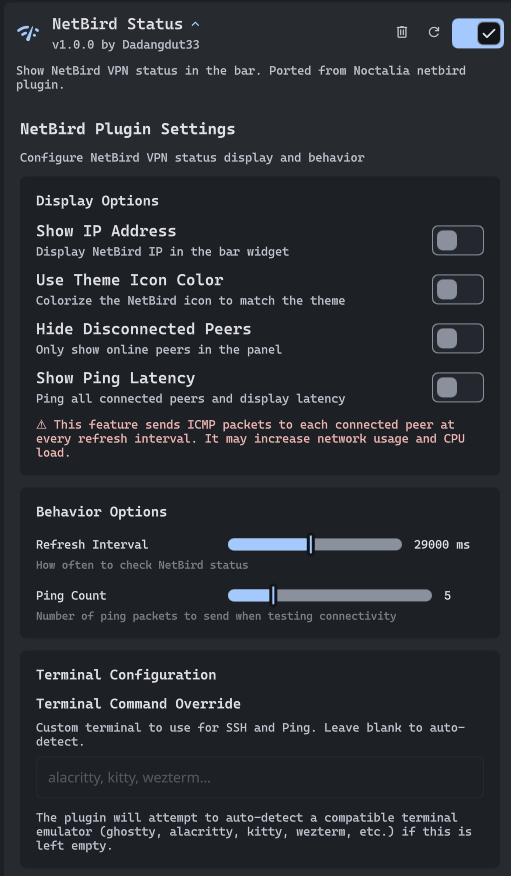

# NetbirdStatus

> [!NOTE]  
> **Disclaimer:** This is a community-created plugin built on top of the NetBird CLI tool. It is not affiliated with, endorsed by, or officially connected to NetBird GmbH.

A NetBird VPN status plugin for DMS that shows your NetBird connection status and peers in the menu bar.

Ported from [netbird plugin in noctalia-shell](https://noctalia.dev/plugins/netbird/) by [Cleeboost](https://github.com/Cleboost). This port does not include adding IPC stuff, only the widget and its functionality.

## Requirements

- NetBird must be installed on your system
- NetBird must be set up and authenticated
- The netbird CLI must be accessible in your PATH

## Troubleshooting

### "Not installed" message

If you see "NetBird not installed", make sure NetBird is installed and the `netbird` binary is accessible in your PATH.

### Status not updating

If the status doesn't update automatically, try:

1. Increasing the refresh interval in settings
2. Using the IPC `refresh` command
3. Checking that NetBird daemon is running (`netbird service status`)

### Cannot connect/disconnect

Ensure that:

- You have proper permissions to control NetBird
- NetBird is authenticated and set up (`netbird up` in terminal first)
- The NetBird daemon service is running (`netbird service start`)
