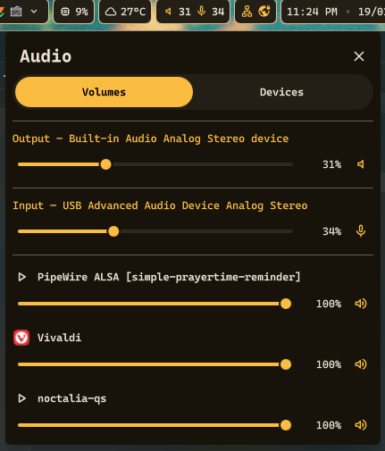
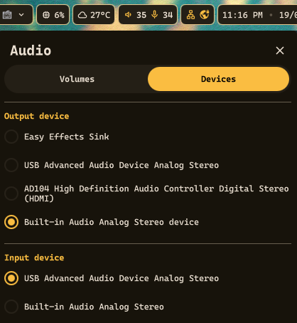
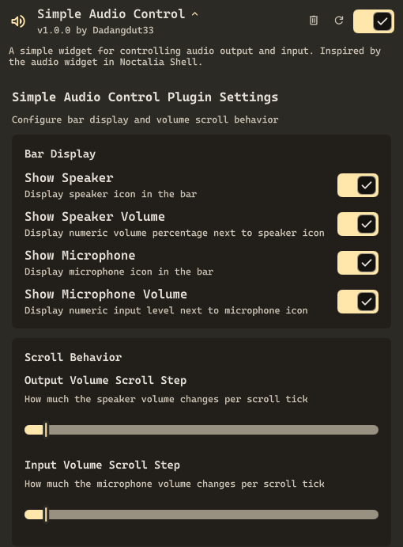

# SimpleAudioControl

A plugin that aims to make audio control easier and more intuitive. It provides a simple widget for controlling audio output and input, and a tab to switch device input / output.

Inspired or rather this is almost like a replica of the Audio widget in [Noctalia Shell](https://github.com/noctalia-dev/noctalia-shell).

## Preview

